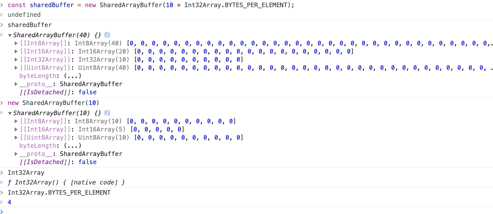

# ES7-ES12 新特性简介

## TC39 的 Stage 阶段进程

```
Stage 0: Strawperson 稻草人？
  Just an idea -- 只是一个想法
Stage 1: Proposal 提案
  Describe shape of solution，Identify potential blockers -- 进入state1，面向委员会讲解和介绍，你需要概述解决方案，并且提出一些潜在的困难。
Stage 2: Draft 草案
  Describe precise syntactic and semantic details -- 进入state2的讨论会更加严肃，需要讨论精确的语法和语义细节
Stage 3: Candidate 候选
  Further feedback from implementations and users -- 收集来自实现者和用户的进一步反馈
Stage 4: Finished 最终
  Tested and ready for addition to the standard -- 测试好并准备好加入标准
```

## ES7（2016）

### 1. Array.prototype.includes

```js
assert([1, 2, 3].includes(2) === true)
assert([1, 2, 3].includes(4) === false)

assert([1, 2, NaN].includes(NaN) === true)

assert([1, 2, -0].includes(+0) === true)
assert([1, 2, +0].includes(-0) === true)

assert(['a', 'b', 'c'].includes('a') === true)
assert(['a', 'b', 'c'].includes('a', 1) === false)
```

引申：

indexOf 和 includes

includes 跟 babel

### 2. Exponentiation operator

幂运算符 `m ** n`

```js
let squared = 2 ** 2
// same as: 2 * 2

let a = 2
a **= 2
// same as: a = a * a;
```

---

## ES8（2017）

### 1. Object.values/Object.entries

获取对象的值/键值对，并以数组形式返回

```js
Object.values({ a: 1, b: 2, c: Symbol() }) // [1, 2, Symbol()]
Object.entries({ a: 1, b: 2, c: Symbol() }) // [["a", 1], ["b", 2], ["c", Symbol()]]
```

### 2. String padding

字符串补全新方法

```js
'foo'.padStart(5) // "  foo"
'foo'.padStart(5, 'abc') // "abfoo"
'foo'.padEnd(5, 'abc') // "fooab"

// 1024个不重复的10长度01矩阵
const arr = []
for (let i = 0; i < 2 ** 10; i++) {
  const bin = (i >>> 0).toString(2)
  arr.push(bin.padStart(10, '0').split(''))
}

// 不用新方法
const arr = []
for (let i = 0; i < 1024; i++) {
  const bin = (i >>> 0).toString(2)
  arr.push(
    bin.length < 10
      ? Array.apply(null, {
          length: 10 - bin.length,
        })
          .map(v => 0)
          .concat(bin.split('').map(v => Number(v)))
      : bin.split('').map(v => Number(v)),
  )
}
```

### 3. Object.getOwnPropertyDescriptors

获取对象的属性描述，如果没有任何自身属性，则返回空对象。

```js
Object.getOwnPropertyDescriptors({ a: 1 })
// {
//   a: {
//     configurable: true, // 密封
//     enumberable: true, // 枚举
//     value: 1,
//     writable: true, // 冻结对象
//   },
// }
Object.getOwnPropertyDescriptors({})
// {}
```

### 4. Trailing commas in function parameter lists and calls

函数参数列表结尾允许逗号

https://exploringjs.com/es2016-es2017/ch_trailing-comma-parameters.html

```js
function foo(
  param1,
  param2, // 这里可以用逗号结尾
) {
  /* ... */
}
foo(
  'abc',
  'def', // 这里可以用逗号结尾
)
let obj = {
  first: 'Jane',
  last: 'Doe', // 这里可以用逗号结尾
}
let arr = [
  'red',
  'green',
  'blue', // 这里可以用逗号结尾
]
```

### 5. async/await

不细说了

### 6. Shared memory and atomics TODO:

ECMAScript 共享内存与 Atomics 的规范

**参考**

https://exploringjs.com/es2016-es2017/ch_shared-array-buffer.html

https://developer.mozilla.org/zh-CN/docs/Web/JavaScript/Reference/Global_Objects/SharedArrayBuffer

https://developer.mozilla.org/zh-CN/docs/Web/JavaScript/Reference/Global_Objects/ArrayBuffer

https://developer.mozilla.org/zh-CN/docs/Web/JavaScript/Reference/Global_Objects/Int32Array

https://developer.mozilla.org/zh-CN/docs/Web/JavaScript/Reference/Global_Objects/Atomics

http://www.ruanyifeng.com/blog/2017/09/asmjs_emscripten.html

这是 ECMAScript 共享内存与 Atomics 的规范，它引入了一个新的构造函数 SharedArrayBuffer 和一个 Atomics 带有辅助函数的名称空间对象。

SharedArrayBuffer 对象用来表示一个通用的，固定长度的原始二进制数据缓冲区，类似于 ArrayBuffer 对象，它们都可以用来在共享内存（shared memory）上创建视图。与 ArrayBuffer 不同的是，SharedArrayBuffer 不能被分离。

```js
/**
 * new SharedArrayBuffer(length)
 * @param {*} length 所创建的数组缓冲区的大小，以字节(byte)为单位。
 * @returns {SharedArrayBuffer} 一个大小指定的新 SharedArrayBuffer 对象。其内容被初始化为 0。兼容性很差。
 */
const buffer = new SharedArrayBuffer(10)
console.log(buffer.byteLength) // 10
const sharedBuffer = new SharedArrayBuffer(10 * Int32Array.BYTES_PER_ELEMENT)
const sharedArray = new Int32Array(10)
// Int32Array(10) [0, 0, 0, 0, 0, 0, 0, 0, 0, 0] 双补码32位有符号的整型数组
const tmp = sharedArray[0]
// 0
```



Atomics 对象提供了一组静态方法对 SharedArrayBuffer 和 ArrayBuffer 对象进行原子操作。

```js
// main.js
const work = new Worker('./worker.js')
work.onmessage = function (e) {
  let data = e.data
  console.log(data) // Int32Array(10) [0, 0, 0, 0, 0, 0, 0, 0, 0, 0]
}
```

```js
// worker.js
const sharedBuffer = new SharedArrayBuffer(Int32Array.BYTES_PER_ELEMENT * 10)
const sharedArray = new Int32Array(sharedBuffer) // (B)
// Share sharedBuffer with the worker
postMessage(sharedArray)
console.log(sharedArray[0]) // Int32Array(10) [0, 0, 0, 0, 0, 0, 0, 0, 0, 0]

setTimeout(() => {
  sharedArray[0] = 5 // 5
  // Atomics.store(typedArray, index, value) 将数组中指定的元素设置为给定的值，并返回该值。
  // typedArray一个指定类型的shared数组. 类型为Int8Array,Uint8Array,Int16Array,Uint16Array,Int32Array,Uint32Array。
  // index typedArray中用来存储value的位置.
  // value要存储的数字.
  console.log(Atomics.store(sharedArray, 0, 123)) // 123
  // Atomics.add 将指定位置上的数组元素与给定的值相加，并返回相加前该元素的值。
  console.log(Atomics.add(sharedArray, 0, 12)) // 123
  // Atomics.load 返回数组中指定元素的值。
  console.log(Atomics.load(sharedArray, 0)) // 135
  console.log(sharedArray) // Int32Array(10) [135, 0, 0, 0, 0, 0, 0, 0, 0, 0]
}, 1000)
```

asm.js 是一种提升 js 执行效率的解决方案，甚至能让浏览器运行 3d 游戏，将 C/C++ 代码编译成 JS 代码

---

## ES9（2018）

### 1. Lifting template literal restriction

模板字符串做方法参数的时候不转义

https://tc39.es/proposal-template-literal-revision/

https://developer.mozilla.org/zh-CN/docs/Web/JavaScript/Reference/Template_literals

模板字符串做方法参数的时候不转义，以前`\u,\x`开头的，解释器发现不满足字符串的转义规则会报`Uncaught SyntaxError: Invalid Unicode escape sequence`语法错误

```js
function tag(strs) {
  console.log(strs) // [undefined, raw: Array(1)]
  console.log(strs.raw) // ["\unicode"]
}
tag`\unicode`
```

#### 扩展

Template literals (Template strings) 模板字符串

自 ES2016 起，带标签的模版字面量遵守以下转义序列的规则：

- 1 Unicode 字符以"\u"开头，例如`\u00A9`
- 2 Unicode 码位用"\u{}"表示，例如`\u{2F804}`
- 3 十六进制以"\x"开头，例如`\xA9`
- 4 八进制以"\"和数字开头，例如`\251`

这表示类似下面这种带标签的模版是有问题的，因为对于每一个 ECMAScript 语法，解析器都会去查找有效的转义序列，但是只能得到这是一个形式错误的语法：

```js
latex`\unicode`
// 在较老的ECMAScript版本中报错（ES2016及更早）
// SyntaxError: malformed Unicode character escape sequence
```

带标签的模版字符串应该允许嵌套支持常见转义序列的语言。ECMAScript 提议模版字面量修订(第 4 阶段，将要集成到 ECMAScript 2018 标准) 移除对 ECMAScript 在带标签的模版字符串中转义序列的语法限制。

不过，非法转义序列在"cooked"当中仍然会体现出来。它们将以 undefined 元素的形式存在于"cooked"之中：

```js
function latex(str) {
  return { cooked: str[0], raw: str.raw[0] }
}
latex`\unicode` // { cooked: undefined, raw: "\\unicode" }
```

### 2. s (dotAll) flag for regular expressions

正则表达式 s(dotAll) 标记

正则表达式中点.匹配除回车外的任何单字符，标记 s 改变这种行为，允许行终止符的出现

```js
;/hello.world/.test('hello\nworld') // false
;/hello.world/s.test('hello\nworld') // true
```

### 3. RegExp named capture groups

正则表达式支持声明匹配名称

https://github.com/tc39/proposal-regexp-named-groups

```js
let re = /(?<year>\d{4})-(?<month>\d{2})-(?<day>\d{2})/u
let result = re.exec('2015-01-02')
// result.groups.year === '2015';
// result.groups.month === '01';
// result.groups.day === '02';

// result[0] === '2015-01-02';
// result[1] === '2015';
// result[2] === '01';
// result[3] === '02';
```

### 4. Rest/Spread Properties

剩余/展开属性

https://developer.mozilla.org/zh-CN/docs/Web/JavaScript/Reference/Operators/Spread_syntax

Rest/Spread Properties for ECMAScript 提议(stage 4) 对 字面量对象 增加了展开特性。其行为是, 将已有对象的所有可枚举(enumerable)属性拷贝到新构造的对象中.

```js
// 剩余属性
let { x, y, ...z } = { x: 1, y: 2, a: 3, b: 4 }
x // 1
y // 2
z // { a: 3, b: 4 }

// 展开属性
let n = { x, y, ...z }
n // { x: 1, y: 2, a: 3, b: 4 }
```

### 5. RegExp Lookbehind Assertions

正则表达式后向断言

https://mathiasbynens.be/notes/es-regexp-proposals#lookbehinds

ES2018 adds support for lookbehind assertions.

1、 Positive lookbehind 肯定的向后断言用 `(?<=...)`

```js
const re = /(?<=\$)\d+/
re.exec('$1 is worth about ¥123') // ["1", index: 1, input: "$1 is worth about ¥123", groups: undefined]
re.exec('$111') // ["111", index: 1, input: "$111", groups: undefined]
```

2、 Negative lookbehind 否定的向后断言用 `(?<!...)`

```js
const re2 = /(?<!\$)\d+/
re2.exec('$1 is worth about ¥123')[0] // '123'

const re3 = /(?<!\d{3}) meters/
console.log(re3.exec('10 meters')) // [" meters", index: 2, input: "10 meters", groups: undefined]
console.log(re3.exec('100 meters')) // null
```

### 6. RegExp Unicode Property Escapes

https://developer.mozilla.org/zh-CN/docs/Web/JavaScript/Guide/Regular_Expressions/Unicode_Property_Escapes

Unicode property escapes 正则表达式 支持根据 Unicode 属性进行匹配，例如我们可以用它来匹配出表情、标点符号、字母(甚至适用特定语言或文字)等。同一符号可以拥有多种 Unicode 属性，属性则有 binary ("boolean-like") 和 non-binary 之分。

语法：

```js
// Non-binary 属性
\p{Unicode属性值}
\p{Unicode属性名=Unicode属性值}

// Binary and non-binary 属性
\p{UnicodeBinary属性名}

// \P 为 \p 取反
\P{Unicode属性值}
\P{UnicodeBinary属性名}
```

示例：

```js
const sentence = 'A ticket to 大阪 costs ¥2000 👌.'

const regexpEmojiPresentation = /\p{Emoji_Presentation}/gu
console.log(sentence.match(regexpEmojiPresentation))
// expected output: Array ["👌"]

const regexpNonLatin = /\P{Script_Extensions=Latin}+/gu
console.log(sentence.match(regexpNonLatin))
// expected output: Array [" ", " ", " 大阪 ", " ¥2000 👌."]

const regexpCurrencyOrPunctuation = /\p{Sc}|\p{P}/gu
console.log(sentence.match(regexpCurrencyOrPunctuation))
// expected output: Array ["¥", "."]
```

### 7. Promise.prototype.finally

Promise 支持 finally 方法了，类似 try/catch/finnally

```js
Promise.resolve()
  .then()
  .catch(e => e)
  .finally()
```

### 8. Asynchronous Iteration

迭代的时候可以写异步方法了

await 可以和 for...of 循环一起使用，以串行的方式运行异步操作

```js
async function process(array) {
  for await (let i of array) {
    console.log(i)
  }
}
```

---

## ES10（2019）

### 1. Optional catch binding

try 的时候 catch 可以不用写参数了

https://developer.mozilla.org/zh-CN/docs/Web/JavaScript/Reference/Statements/try...catch

```js
try {
  // try to use a web feature which may not be implemented
} catch (unused) {
  // fall back to a less desirable web feature with broader support
}
// 现在写
try {
  // ...
} catch {}
```

### 2. JSON superset

JSON 格式支持 U+2028 和 U+2029 两个字符了

将 ECMAScript 变成 JSON 超集的提案，JSON 字符串可以包含未转义的`\u2028 Line separator`和`\u2029 Paragraph separator`字符。简单地说就是 ECMAScript 不允许 `U+2028` 和 `U+2029` 这两个`换行符`单独出现在字符串字面量中，而 JSON 允许，于是如果是单独出现了这两个字符的 JSON，直接当作 ECMAScript 代码，就会报错。

### 3. Symbol.prototype.description

Symbol 对象的 description 属性能返回描述了

```js
Symbol('description').description // 'description'
```

### 4. Function.prototype.toString revision

函数的字符化表示优化

对函数的 toString 规则进行了修改：http://tc39.github.io/Function-prototype-toString-revision/#sec-function.prototype.tostring https://2ality.com/2016/08/function-prototype-tostring.html

当调用内置函数或 .bind 后函数，toString 方法会返回 NativeFunction。

```js
isNaN.toString()
// "function isNaN() { [native code] }"
;(function foo() {}.bind(null).toString())
// 'function () { [native code] }'
```

### 5. Object.fromEntries

数组转 JSON，Object.entries 的对称方法，返回一个给定对象自身可枚举属性的键值对数组

```js
// 通过 Object.fromEntries， 可以将 Map 转化为 Object:
const map = new Map([
  ['key1', '1'],
  ['key2', 2],
])
let a = Object.fromEntries(map)
console.log(a) // {key1: "1", key2: 2}
Object.entries(a) // [['key1', '1'],['key2', 2],]
```

### 6. Well-formed JSON.stringify

避免 JSON 字符串化的时候错误字符转义

https://developer.mozilla.org/en-US/docs/Web/JavaScript/Reference/Global_Objects/JSON/stringify

```js
// 之前
JSON.stringify('\uD800') // '"�"'
// 现在
JSON.stringify('\uD800') // '"\\ud800"'
```

### 7. String.prototype.{trimStart,trimEnd}

字符串支持 trimStart 和 trimEnd 方法，去除字符串首尾空白字符

```js
let str = '  abc  '
str.trimStart() // "abc  "
str.trimEnd() // "  abc"
```

### 8. Array.prototype.{flat,flatMap}

Array.flat 多维数组扁平化

```js
;[1, 2, [3, 4]].flat(Infinity) // [1, 2, 3, 4]
```

Array.flatMap

https://developer.mozilla.org/zh-CN/docs/Web/JavaScript/Reference/Global_Objects/Array/flatMap

flatMap 方法首先使用映射函数映射每个元素，然后将结果压缩成一个新数组。它与 map 连着深度值为 1 的 flat 几乎相同，但 flatMap 通常在合并成一种方法的效率稍微高一些。

```js
const arr1 = [1, 2, 3, 4]
arr1.map(x => [x * 2])
// [[2], [4], [6], [8]]
arr1.map(x => [x * 2]).flat(1)
// [2, 4, 6, 8]
arr1.flatMap(x => [x * 2])
// [2, 4, 6, 8]
// only one level is flattened
arr1.flatMap(x => [[x * 2]])
// [[2], [4], [6], [8]]
```

---

## ES11（2020）

### 1. String.prototype.matchAll

matchAll 方法返回一个包含所有匹配正则表达式的结果及分组捕获组的迭代器。

https://developer.mozilla.org/zh-CN/docs/Web/JavaScript/Reference/Global_Objects/String/matchAll

```js
const regexp = /t(e)(st(\d?))/g
const str = 'test1test2'
const array = [...str.matchAll(regexp)] // RegExpStringIterator
console.log(array[0]) // expected output: Array ["test1", "e", "st1", "1"]
console.log(array[1]) // expected output: Array ["test2", "e", "st2", "2"]

console.log(str.match(regexp)) // ["test1", "test2"] 没有子项
const regexp2 = /t(e)(st(\d?))/
console.log(str.match(regexp2)) // expected output: Array ["test1", "e", "st1", "1"] 没有test2
```

### 2. import()

按需导入

https://github.com/tc39/proposal-dynamic-import

https://developer.mozilla.org/zh-CN/docs/Web/JavaScript/Reference/Statements/import

```js
let module = await import('/modules/my-module.js').then(module => {
  // Do something with the module.
})
```

### 3. BigInt

新**基本数据类型** BigInt 任意精度的整数

https://developer.mozilla.org/zh-CN/docs/Web/JavaScript/Reference/Global_Objects/BigInt

现在是 7 种基本数据类型了，String、Number、Boolean、Null、Undefined、Symbol(ES6)、BigInt(ES11)

Number 类型只能安全的表示 `Number.MIN_SAFE_INTEGER` `-(2 ** 53-1)`至 `Number.MAX_SAFE_INTEGER` `2 ** 53-1` 范围的值。js 使用 64 位浮点数处理所有计算，直接导致了运算效率低下，这个提案弥补了 js 的计算缺点

```js
let num = Number.MAX_SAFE_INTEGER // 9007199254740991
console.log(num + 1) // 9007199254740992
console.log(num + 2) // 9007199254740992
```

BigInt 是一种内置对象，它提供了一种方法来表示大于 `Number.MAX_SAFE_INTEGER` 的整数。BigInt 可以表示任意大的整数。

#### 描述

可以用在一个整数字面量后面加 n 的方式定义一个 BigInt ，如：10n，或者调用函数 BigInt()。

```js
const theBiggestInt = 9007199254740991n
const alsoHuge = BigInt(9007199254740991) // ↪ 9007199254740991n
const hugeString = BigInt('9007199254740991') // ↪ 9007199254740991n
const hugeHex = BigInt('0x1fffffffffffff') // ↪ 9007199254740991n
const hugeBin = BigInt('0b11111111111111111111111111111111111111111111111111111') // ↪ 9007199254740991n
```

它在某些方面类似于 Number ，但是也有几个关键的不同点：不能用于 Math 对象中的方法；不能和任何 Number 实例混合运算，两者必须转换成同一种类型。在两种类型来回转换时要小心，因为 BigInt 变量在转换成 Number 变量时可能会丢失精度。

**类型信息**

```js
typeof 1n // 'bigint'
typeof BigInt('1') // 'bigint'
Object(1n) // BigInt {1n}
typeof Object(1n) // 'object'
```

**运算**

以下操作符可以和 BigInt 一起使用： +、`*`、`-`、`**`、`%` 。除 >>> （无符号右移）之外的 位操作 也可以支持。因为 BigInt 都是有符号的， >>> （无符号右移）不能用于 BigInt。为了兼容 asm.js ，BigInt 不支持单目 (+) 运算符。

```js
Number.MIN_SAFE_INTEGER === - (2**53 -1) // -9007199254740991
Number.MAX_SAFE_INTEGER === 2**53 -1 // 9007199254740991
const previousMaxSafe = BigInt(Number.MAX_SAFE_INTEGER); // ↪ 9007199254740991n
const maxPlusOne = previousMaxSafe + 1n; // ↪ 9007199254740992n
const theFuture = previousMaxSafe + 2n; // ↪ 9007199254740993n, this works now!
const multi = previousMaxSafe * 2n; // ↪ 18014398509481982n
const subtr = multi – 10n; // ↪ 18014398509481972n
const mod = multi % 10n; // ↪ 2n
const bigN = 2n ** 54n; // ↪ 18014398509481984n
bigN * -1n // ↪ –18014398509481984n
```

当使用 BigInt 时，带小数的运算会被取整。

```js
const expected = 4n / 2n // ↪ 2n
const rounded = 5n / 2n // ↪ 2n, not 2.5n
```

**比较**

```js
// BigInt 和 Number 不是严格相等的，但是宽松相等的。
0n === 0 // ↪ false
0n == 0 // ↪ true
// Number 和 BigInt 可以进行比较。
1n < 2 // ↪ true
2n > 1 // ↪ true
2n > 2 // ↪ false
2n < 2 // ↪ false
2n >= 2 // ↪ true
// 两者也可以混在一个数组内并排序。
const mixed = [4n, 6, -12n, 10, 4, 0, 0n] // ↪  [4n, 6, -12n, 10, 4, 0, 0n]
mixed.sort() // ↪ [-12n, 0, 0n, 10, 4n, 4, 6]
// 注意被  Object 包装的 BigInts 使用 object 的比较规则进行比较，只用同一个对象在比较时才会相等。
0n === Object(0n) // false
Object(0n) === Object(0n) // false
const o = Object(0n)
o === o // true
```

**条件**

BigInt 在需要转换成 Boolean 的时表现跟 Number 类似：如通过 Boolean 函数转换；用于逻辑运算符 `||`, `&&`, 和 `!` 的操作数；或者用于在像 `if statement` 这样的条件语句中。

```js
if (0n) {
  console.log('Hello from the if!')
} else {
  console.log('Hello from the else!') // ↪ "Hello from the else!"
}
0n || 12n // ↪ 12n
0n && 12n // ↪ 0n
Boolean(0n) // ↪ false
Boolean(12n) // ↪ true
!12n // ↪ false
!0n // ↪ true
```

#### 使用建议

**转化**

由于在 Number 与 BigInt 之间进行转换会损失精度，因而建议仅在值可能大于 `2**53` 时使用 BigInt 类型，并且不在两种类型之间进行相互转换。

**密码学**

由于对 BigInt 的操作不是常数时间的，因而 BigInt 不适合用于密码学。

**在 JSON 中使用**

对任何 BigInt 值使用 `JSON.stringify()` 都会引发 `TypeError`，因为默认情况下 BigInt 值不会在 JSON 中序列化。但是，如果需要，可以实现 toJSON 方法：

```js
BigInt.prototype.toJSON = function () {
  return this.toString()
}
// JSON.stringify 现在生成如下字符串，而不是抛出异常:
JSON.stringify(BigInt(1))
// '"1"'
```

### 4. Promise.allSettled

https://developer.mozilla.org/zh-CN/docs/Web/JavaScript/Reference/Global_Objects/Promise/allSettled

`Promise.all()` 有并发执行异步任务的能力，但它的最大问题就是如果其中某个任务 `reject`，所有任务都会挂掉，Promise 直接 `reject` 状态执行 `catch` 回调。适合当有任何一个任务 `reject` 时立即结束的场景。

`Promise.allSettled()` 方法返回一个在所有给定的 `promise` 都已经 `fulfilled` 或 `rejected` 后的 `promise`，并带有一个对象数组，每个对象表示对应的 `promise` 结果。当您有多个彼此不依赖的异步任务成功完成时，或者您总是想知道每个 promise 的结果时，通常使用它。

```js
const promise1 = Promise.resolve(3)
const promise2 = new Promise((resolve, reject) => setTimeout(reject, 100, 'foo'))
const promises = [promise1, promise2]

Promise.allSettled(promises).then(results => {
  console.log(results)
  results.forEach(result => console.log(result.status))
  // 再通过filter过滤出想要的状态 result.status === 'fulfilled'
})
// [{status: "fulfilled", value: 3},{status: "rejected", reason: "foo"}]
// "fulfilled"
// "rejected"
```

语法

```js
/**
 * Promise.allSettled(iterable)
 * @param {*} iterable iterable 一个可迭代的对象，例如Array，其中每个成员都是Promise。
 * @returns {} 一旦所指定的 promises 集合中每一个 promise 已经完成，无论是成功的达成或被拒绝，未决议的 Promise将被异步完成。那时，所返回的 promise 的处理器将传入一个数组作为输入，该数组包含原始 promises 集中每个 promise 的结果。
 对于每个结果对象，都有一个 status 字符串。如果它的值为 fulfilled，则结果对象上存在一个 value 。如果值为 rejected，则存在一个 reason 。value（或 reason ）反映了每个 promise 决议（或拒绝）的值。
 */
Promise.allSettled(iterable)
```

### 5. globalThis

统一全局对象名称，不用各种判断兼容了

https://developer.mozilla.org/zh-CN/docs/Web/JavaScript/Reference/Global_Objects/globalThis

你可以安心的使用 globalThis，不必担心它的运行环境。为便于记忆，你只需要记住，全局作用域中的 this 就是 globalThis。

```js
// 浏览器：window、self、frames
// worker：self
// node：global
var getGlobal = function () {
  if (typeof self !== 'undefined') {
    return self
  }
  if (typeof window !== 'undefined') {
    return window
  }
  if (typeof global !== 'undefined') {
    return global
  }
  throw new Error('unable to locate global object')
}
var globals = getGlobal()
if (typeof globals.setTimeout !== 'function') {
  // 此环境中没有 setTimeout 方法！
}
```

### 6. for-in mechanics

for-in 循环时候的输出顺序

以前 ECMA-262 在不同的引擎下 for in 循环出来的内容顺序是可能不一样的，现在标准化了。

### 7. Optional Chaining 可选链

可选链 `?.` 用于检测多层对象中不确定的中间节点，不用再做冗余的容错。

```js
let user = {}
let name = user.info.name // TypeError: Cannot read property 'name' of undefined
let name = user.info?.name // undefined
```

### 8. Nullish coalescing Operator

空值合并运算符

https://developer.mozilla.org/zh-CN/docs/Web/JavaScript/Reference/Operators/Nullish_coalescing_operator

以前，如果想为一个变量赋默认值，通常的做法是使用逻辑或操作符`||`，然而，由于 `||` 是一个布尔逻辑运算符，左侧的操作数会被强制转换成布尔值用于求值。任何假值`0， ''， NaN， null， undefined`都不会被返回。

空值合并操作符 `??` 是一个逻辑操作符，当左侧的操作数为 `null` 或者 `undefined` 时，返回其右侧操作数，否则返回左侧操作数。

```js
console.log(0 || 42) // 42
console.log('' || 'hi!') // "hi!"
console.log(0 ?? 42) // 0
console.log('' ?? 'hi!') // ''
console.log(false ?? 'hi!') // false
console.log(null ?? 'hi!') // "hi!"
console.log(undefined ?? 'hi!') // "hi!"
```

**短路**

与 OR 和 AND 逻辑操作符相似，当左表达式不为 null 或 undefined 时，不会对右表达式进行求值。

```js
function A() {
  console.log('函数 A 被调用了')
  return undefined
}
function B() {
  console.log('函数 B 被调用了')
  return false
}
function C() {
  console.log('函数 C 被调用了')
  return 'foo'
}

console.log(A() ?? C())
// 依次打印 "函数 A 被调用了"、"函数 C 被调用了"、"foo"
// A() 返回了 undefined，所以操作符两边的表达式都被执行了

console.log(B() ?? C())
// 依次打印 "函数 B 被调用了"、"false"
// B() 返回了 false（既不是 null 也不是 undefined）
// 所以右侧表达式没有被执行
```

**不能与 AND 或 OR 操作符共用**

将`??`直接与`&&`和 `||`操作符组合使用会报错，应当是因为空值合并操作符和其他逻辑操作符之间的运算优先级/运算顺序是未定义的）这种情况下会抛出 `SyntaxError` 。但是，如果使用括号来显式表明运算优先级，是没有问题的。

```js
null || undefined ?? "foo"; // Uncaught SyntaxError: Unexpected token '??'
true || undefined ?? "foo"; // 抛出 SyntaxError
(null || undefined ) ?? "foo"; // 返回 "foo"
```

**实际应用**

单独应用场景不大，不如强类型判断。一般配合可选链使用

```js
console.log(user.info?.name ?? '默认名字')
```

### 9. import.meta

模块自身的元信息

https://developer.mozilla.org/zh-CN/docs/Web/JavaScript/Reference/Statements/import.meta

import.meta 是一个给 JavaScript 模块暴露特定上下文的元数据属性的对象。它包含了这个模块的信息，比如说这个模块的 URL。

import.meta 对象是由 ECMAScript 实现的，它带有一个 null 的原型对象。这个对象可以扩展，并且它的属性都是可写，可配置和可枚举的。

```html
这里有一个 my-module.mjs模块
<script type="module" src="my-module.mjs"></script>
你可以通过 import.meta 对象获取这个模块的元数据信息.
<script>
  console.log(import.meta) // { url: "file:///home/user/my-module.mjs" }
</script>
它返回一个带有url属性的对象，指明模块的基本URL。也可以是外部脚本的URL，还可以是内联脚本所属文档的URL。注意，url也可能包含参数或者哈希（比如后缀?或#）
```

在脚本中引入别的脚本同样生效：

```html
<script type="module">
  // index.mjs
  import './index.mjs?someURLInfo=5'
  // index2.mjs
  new URL(import.meta.url).searchParams.get('someURLInfo') // 5
</script>
```

---

## ES12（2021）

### 1. String.prototype.replaceAll

字符串全部替换

replaceAll() 方法返回一个新字符串，新字符串所有满足 `pattern` 的部分都已被 `replacement` `替换。pattern` 可以是**一个字符串或一个 `RegExp`** ，`replacement` 可以是一个字符串或一个在每次匹配被调用的函数。

```js
const p = 'The quick brown fox jumps over the lazy dog. If the dog reacted, was it really lazy?'
console.log(p.replaceAll('dog', 'monkey'))
// expected output: "The quick brown fox jumps over the lazy monkey. If the monkey reacted, was it really lazy?"
// global flag required when calling replaceAll with regex
const regex = /Dog/gi
console.log(p.replaceAll(regex, 'ferret'))
// expected output: "The quick brown fox jumps over the lazy ferret. If the ferret reacted, was it really lazy?"
```

### 2. Promise.any

Promise.any() 接收一个 Promise 可迭代对象，只要其中的一个 promise 成功，就返回那个已经成功的 promise 。如果可迭代对象中没有一个 promise 成功（即所有的 promises 都失败/拒绝），就返回一个失败的 promise 和 [AggregateError](https://developer.mozilla.org/zh-CN/docs/Web/JavaScript/Reference/Global_Objects/AggregateError) 类型的实例，它是 Error 的一个子类，用于把单一的错误集合在一起。本质上，这个方法和 Promise.all()是相反的。

```js
/**
 * Promise.any(iterable);
 * @param {*} iterable iterable 一个可迭代的对象，例如Array，其中每个成员都是Promise。
 * @returns {}
 */
如果传入的参数是一个空的可迭代对象，则返回一个 已失败（already rejected） 状态的 Promise。
如果传入的参数不包含任何 promise，则返回一个 异步完成 （asynchronously resolved）的 Promise。
其他情况下都会返回一个处理中（pending） 的 Promise。 只要传入的迭代对象中的任何一个 promise 变成成功（resolve）状态，或者其中的所有的 promises 都失败，那么返回的 promise 就会 异步地（当调用栈为空时） 变成成功/失败（resolved/reject）状态。
```

即使第一个返回的 promise 是失败的，`Promise.any()` 依然使用第一个成功状态的 promise 来返回。这与使用首个（无论 rejected 还是 fullfiled）promise 来返回的 `Promise.race()` 相反。

```js
const pErr = new Promise((resolve, reject) => {
  reject('总是失败')
})
const pSlow = new Promise((resolve, reject) => {
  setTimeout(resolve, 500, '最终完成')
})
const pFast = new Promise((resolve, reject) => {
  setTimeout(resolve, 100, '很快完成')
})

Promise.any([pErr, pSlow, pFast]).then(value => {
  // pFast fulfils first
  console.log(value) // "很快完成"
  // Promise {<fulfilled>: undefined}
})
```

如果没有 fulfilled (成功的) promise，`Promise.any()` 返回 `AggregateError` 错误。

```js
const pErr = new Promise((resolve, reject) => {
  reject('总是失败')
})
Promise.any([pErr]).catch(err => {
  console.log(err) // AggregateError: All promises were rejected
})
```

### 3. WeakRefs TODO:

WeakRef 对象允许您保留对另一个对象的弱引用，而不会阻止被弱引用对象被 GC(垃圾回收)回收

https://developer.mozilla.org/zh-CN/docs/Web/JavaScript/Reference/Global_Objects/WeakRef

WeakRef 对象包含对对象的弱引用，这个弱引用被称为该 WeakRef 对象的 target 或者是 referent 。对对象的弱引用是指当该对象应该被 GC 回收时不会阻止 GC 的回收行为。而与此相反的，一个普通的引用（默认是强引用）会将与之对应的对象保存在内存中。只有当该对象没有任何的强引用时，JavaScript 引擎 GC 才会销毁该对象并且回收该对象所占的内存空间。如果上述情况发生了，那么你就无法通过任何的弱引用来获取该对象。

Note: 在使用前请阅读 Avoid where possible，对于 WeakRef 对象的使用要慎重考虑，能不使用就尽量不要使用

### 4. Logical Assignment Operators

条件赋值新语法

逻辑运算符和赋值表达式，新特性结合了逻辑运算符（&&，||，??）和赋值表达式而 JavaScript 已存在的 复合赋值运算符有：

```js
a ||= b // a = a || (a = b)
a &&= b // a = a && (a = b)
a ??= b // a = a ?? (a = b)

const a = { duration: 50, title: '' }
a.duration ||= 10
console.log(a.duration) // 50
a.title ||= 'title is empty'
console.log(a.title) // "title is empty"
```

### 5. Numeric separators

数字分隔符，可以在数字之间创建可视化分隔符，通过\_下划线来分割数字，使数字更具可读性

```js
console.log(1_000_000_000) // 1000000000 千分符
console.log(101_475_938.38) // 101475938.38

console.log(123_00) //12300
console.log(12_300) // 12300
console.log(12345_00) // 1234500
console.log(123_4500) // 1234500
console.log(1_234_500) // 1234500

1_000_000_000 === 1000000000 // true
```

## 参考

[tc39 proposals](https://github.com/tc39/proposals)

[Finished Proposals](https://github.com/tc39/proposals/blob/master/finished-proposals.md) 最终提案是指已到达第 4 阶段的提案，并已包含在规范的最新草案中。

[TC39, ECMAScript, and the Future of JavaScript](https://ponyfoo.com/articles/tc39-ecmascript-proposals-future-of-javascript)

[Exploring JS: JavaScript books for programmers](https://exploringjs.com/es2016-es2017/)

[MDN JavaScript](https://developer.mozilla.org/zh-CN/docs/Web/JavaScript)
